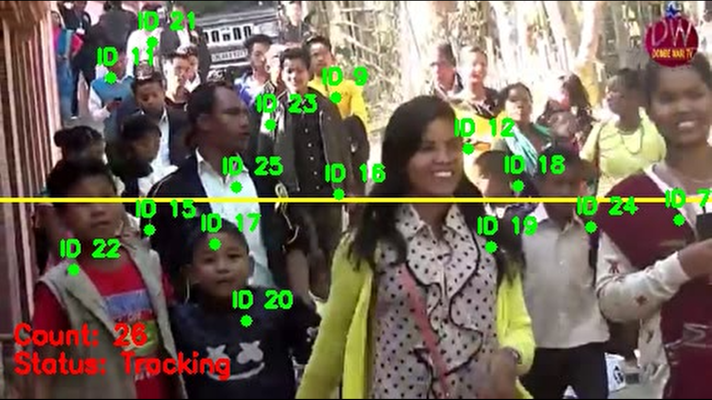

# Person Counter
#### This project aims to track people and update people count in realtime using OpenCV and dlib in Python

### Prerequisites:

- Python >= 3.6
- Anaconda

### Python library requirements:

- numpy
- opencv
- imutils
- dlib
- matplotlib

### Setup

##### Step 1: Install Anaconda

Download and install Anaconda from official website: [Anaconda official website][anaconda]

##### Step 2: Create Conda Environment

Open Anaconda command prompt from Windows start menu. First of all update anaconda packages by issuing the following commands.

    conda update conda
    conda update anaconda

Now, we will create a new conda environment.

	conda create -n person_detector python=3.6

##### Step 3: Activate new environment

We need to activate the newly created conda environment by using the following command:

	conda activate person_detector

After issuing the above command, we will be migrated from conda ‘base’ to ‘person_detector'.

##### Step 4: Install Dlib

Just type in the following command to download and install the latest version of dlib from conda-forge repositories.

	conda install -c conda-forge dlib

This will download all the required dependencies on its own. Just press ‘Y’ to proceed.

##### Step 5: Clone the Repo

Clone or download the [Person_Counter][repo] repository from github

	git clone https://github.com/gokulramtj/Person_Counter.git Person_Counter

##### Step 6: Install other requirements:

Go to the Person_Counter directory and use the requirements.txt file to install the requirements.

	cd Person_Counter
	pip install -r requirements.txt

### Usage:

Run the python script by passing a video to the input argument:

	python people_counter.py -i <path to the video source>

##### Syntax:

	people_counter.py [-h] [-p PROTOTXT] [-m MODEL] -i INPUT [-o OUTPUT]
                         [-c CONFIDENCE] [-s SKIP_FRAMES]

##### Example:

	python people_counter.py -i videos\example_01.mp4

##### Optional arguments:

- **-h, --help:** Show this help message and exit

- **-p PROTOTXT, --prototxt PROTOTXT:** Path to Caffe 'deploy' prototxt file

- **-m MODEL, --model MODEL:** Path to Caffe pre-trained model

- **-i INPUT, --input INPUT:** Path to optional input video file

- **-o OUTPUT, --output OUTPUT:** Path to optional output video file

- **-c CONFIDENCE, --confidence CONFIDENCE:** Minimum probability to filter weak detections

- **-s SKIP_FRAMES, --skip-frames SKIP_FRAMES:** # of skip frames between detections

- **-a ALERT, --alert ALERT:** # of minimum people to start alert

- **-g GRAPH, --graph GRAPH:** option to plot tracking

### Output:

[repo]: https://github.com/gokulramtj/Person_Counter "Person_Counter Github repo"
[anaconda]: https://www.anaconda.com/distribution/#download-section "Download Anaconda "